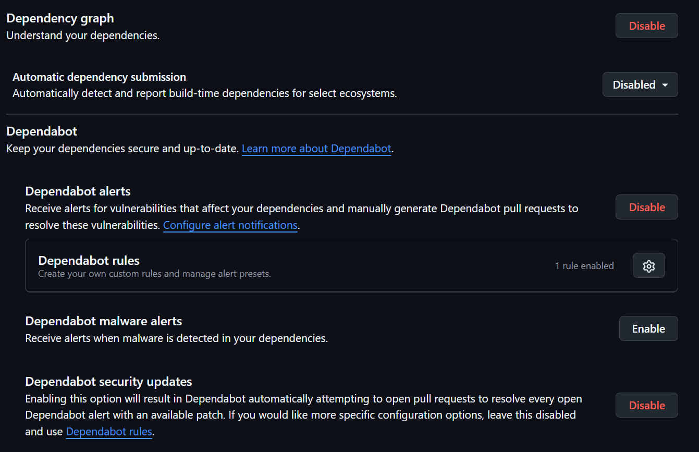

# Sécurité

## Gestion des secrets

Les secrets ne doivent jamais être stockés dans le dépôt Git.

Les variables sensibles sont stockées dans :

* .env local
* Variables Railway
* Variables Vercel

## Variables sensibles

* JWT_SECRET
* MONGO_URI
* DISCORD_WEBHOOK_URL
* ADMIN_PASSWORD

## Authentification

L'application utilise JWT pour sécuriser les accès.

## Bonnes pratiques

* Ne jamais commit un fichier .env
* Utiliser des mots de passe forts
* Limiter les droits utilisateurs
* Vérifier les permissions côté backend

## Rotation des secrets

Les secrets doivent être renouvelés régulièrement.

## Sécurité du dépôt GitHub

Les fonctionnalités de sécurité GitHub ont été activées afin d'améliorer la protection du projet.

Fonctionnalités activées :

* Dependabot Alerts
* Dependabot Security Updates
* Secret Scanning

Ces outils permettent :

* la détection automatique des dépendances vulnérables ;
* la proposition de mises à jour de sécurité ;
* la détection des secrets accidentellement publiés dans le dépôt.

**Capture d'écran :**

